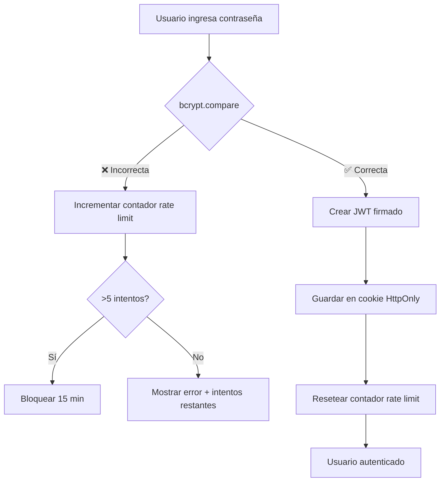

# 🔒 Sistema de Autenticación Seguro - /actas

**Última actualización:** 6 de febrero de 2026  
**Estado:** ✅ SEGURO - Implementación JWT + bcrypt completada

---

## 🎉 Mejoras de Seguridad Implementadas

### ✅ Vulnerabilidades Corregidas

| Vulnerabilidad | Estado Anterior | Estado Actual |
|----------------|-----------------|---------------|
| **Contraseña en texto plano** | 🔴 CRÍTICO | ✅ **CORREGIDO** - bcrypt (12 rounds) |
| **Cookie falsificable** | 🔴 CRÍTICO | ✅ **CORREGIDO** - JWT firmado |
| **Sin rate limiting** | 🔴 CRÍTICO | ✅ **CORREGIDO** - 5 intentos/15 min |
| **Sin logging** | 🟡 MEDIO | ✅ **CORREGIDO** - Logs en consola |
| **Token simple** | 🟡 MEDIO | ✅ **CORREGIDO** - JWT con expiración |

---

## 🛡️ Características de Seguridad

### 1. JWT (JSON Web Tokens)
- **Algoritmo:** HS256 (HMAC-SHA256)
- **Firma:** Criptográfica con JWT_SECRET (512 bits)
- **Expiración:** 24 horas automática
- **Validación:** En cada petición al servidor
- **Imposible de falsificar** sin la clave secreta

### 2. bcrypt Password Hashing
- **Algoritmo:** bcrypt
- **Rounds:** 12 (4096 iteraciones)
- **Salt:** Aleatorio único por hash
- **Tiempo de hash:** ~300-500ms (protección contra fuerza bruta)

### 3. Rate Limiting
- **Límite:** 5 intentos fallidos
- **Ventana:** 15 minutos
- **Almacenamiento:** In-memory (Map)
- **Mensaje:** Muestra intentos restantes al usuario
- **Reset:** Automático tras ventana o éxito

### 4. Cookie Security
- **HttpOnly:** ✅ Protección contra XSS
- **Secure:** ✅ Solo HTTPS en producción
- **SameSite:** ✅ Lax (protección CSRF)
- **Path:** `/`
- **MaxAge:** 24 horas

### 5. Logging y Auditoría
- Intentos fallidos con timestamp
- IPs (preparado para producción)
- Logins exitosos
- Rate limit warnings

---

## 📋 Configuración

### Paso 1: Generar Credenciales

```bash
# Ejecutar el script de generación
./scripts/generate-security-credentials.sh "TuContraseñaAqui"

# O sin argumentos (pedirá la contraseña de forma segura)
./scripts/generate-security-credentials.sh
```

El script generará:
- `JWT_SECRET`: Cadena aleatoria de 512 bits (128 caracteres hex)
- `ACTAS_PASSWORD_HASH`: Hash bcrypt de tu contraseña

### Paso 2: Actualizar .env.local

```env
# Authentication (SECURE)
JWT_SECRET=9989ae33c6dab3c1f6e5e5bcaa8d17a3c85d90774e00c9d09b5d2e8294864a4169b6da3a16ee2c1680eced25a3df41ae5f0b6edd68aeca10e52b8d0d1afe8d75
ACTAS_PASSWORD_HASH=$2b$12$w76TCD9qYnp4FZzTQtjiyOFPf0vzkOaCyb2jOaepjXR5qGUZ.PlDa
```

⚠️ **IMPORTANTE:** 
- Nunca commitear `.env.local`
- Guardar JWT_SECRET en lugar seguro
- Usar secretos diferentes en dev/prod

### Paso 3: Reiniciar Servidor

```bash
pnpm dev
```

---

## 🧪 Pruebas de Seguridad

### Test Automático

```bash
node test-security-verification.js
```

**Verifica:**
- ✅ Cookie forgery bloqueada
- ✅ Tokens falsos rechazados
- ✅ JWT firmado correctamente
- ✅ Rate limiting funcional
- ✅ Flags de seguridad en cookies

### Test Manual (Navegador)

1. **Abrir:** http://localhost:3000/actas
2. **DevTools:** F12 → Application → Cookies
3. **Intentar crear cookie falsa:**
   - Name: `actas_auth`
   - Value: `authenticated`
4. **Refrescar página:** ❌ Debe seguir mostrando login
5. **Login correcto:** Cookie debe ser JWT largo
6. **Intentos fallidos:** Después de 5, debe bloquear

### Test de Cookie Forgery

```bash
node test-cookie-forgery.js
```

Confirma que ya no es posible saltarse la autenticación.

---

## 🔐 Formato de Contraseña Recomendado

```
Patrón: Word#-Word#-Word#-Word#
Ejemplo: Premises2-Rebuttal3-Same7-Denote2

Características:
✅ 4 palabras capitalizadas
✅ Números de 1 dígito después de cada palabra
✅ Separadas por guiones
✅ ~30-40 caracteres
✅ Alta entropía (~60 bits)
```

---

## 📊 Comparación Antes/Después

### Antes (VULNERABLE)

```typescript
// Cookie simple
Cookie: actas_auth=authenticated

// Verificación
return session?.value === 'authenticated'

// ❌ Cualquiera puede crear esta cookie manualmente
```

### Después (SEGURO)

```typescript
// JWT firmado
Cookie: actas_auth=eyJhbGciOiJIUzI1NiIsInR5cCI6IkpXVCJ9.eyJhdXRoZW50aWNhdGVkIjp0cnVlLCJpYXQiOjE3MDcxODI0MDB9.signature...

// Verificación con firma criptográfica
const secret = new TextEncoder().encode(process.env.JWT_SECRET)
await jwtVerify(session.value, secret)

// ✅ Imposible falsificar sin JWT_SECRET
```

---

## 🚀 Flujo de Autenticación



---

## 📝 Archivos Modificados

### Nuevos Archivos
- `scripts/generate-security-credentials.sh` - Generador de credenciales (bash)
- `test-security-verification.js` - Suite de tests de seguridad
- `test-cookie-forgery.js` - Test específico de falsificación
- `SECURITY-IMPLEMENTATION.md` - Esta documentación

### Archivos Actualizados
- `src/lib/auth.ts` - Implementación JWT + bcrypt + rate limiting
- `src/components/LoginForm.tsx` - Manejo de errores mejorado
- `.env.local.example` - Variables de entorno actualizadas
- `package.json` - Dependencias: jose, bcrypt

---

## 🔄 Mantenimiento

### Cambiar Contraseña

```bash
# 1. Generar nuevo hash
./scripts/generate-security-credentials.sh "NuevaContraseña1-Aqui2-Va3-La4"

# 2. Actualizar ACTAS_PASSWORD_HASH en .env.local
# 3. NO cambiar JWT_SECRET (invalidaría sesiones activas)

# 4. Reiniciar servidor
pnpm dev
```

### Rotar JWT_SECRET (Invalidar todas las sesiones)

```bash
# 1. Generar nuevo JWT_SECRET
./scripts/generate-security-credentials.sh "MismaContraseña"

# 2. Actualizar JWT_SECRET en .env.local
# 3. Reiniciar servidor
# 4. Todos los usuarios deben volver a hacer login
```

### Monitoreo de Logs

```bash
# Ver intentos fallidos
grep "Failed login" /tmp/next-dev.log

# Ver rate limits
grep "Rate limit exceeded" /tmp/next-dev.log

# Logins exitosos
grep "Successful login" /tmp/next-dev.log
```

---

## 🌐 Deployment a Producción

### Variables de Entorno (Vercel)

```bash
# En Vercel Dashboard → Settings → Environment Variables
JWT_SECRET=<generar_nuevo_para_produccion>
ACTAS_PASSWORD_HASH=<generar_nuevo_hash>
```

⚠️ **IMPORTANTE:**
- Usar JWT_SECRET diferente en producción
- No copiar valores de desarrollo
- Mantener secretos en lugares seguros (1Password, etc.)

### Verificación Post-Deploy

```bash
# Test de producción
curl -I https://your-domain.com/actas

# Verificar HTTPS
# Verificar Secure cookie flag
```

---

## 🆘 Troubleshooting

### Error: "JWT_SECRET not configured"

```bash
# Verificar que .env.local tiene JWT_SECRET
grep JWT_SECRET .env.local

# Si no existe, generar:
./scripts/generate-security-credentials.sh "TuContraseña"
```

### Error: "bcrypt not installed"

```bash
pnpm install bcrypt
pnpm rebuild bcrypt
```

### Rate limit no funciona

```
# Es in-memory, se resetea al reiniciar servidor
# Para producción, considerar Redis
```

### Cookie no se guarda

```
# Verificar:
1. Servidor corriendo en localhost o HTTPS
2. Secure flag desactivado en development
3. Navegador no bloquea cookies de terceros
```

---

## 📚 Referencias

- [JWT.io](https://jwt.io/) - Información sobre JWT
- [bcrypt npm](https://www.npmjs.com/package/bcrypt) - bcrypt docs
- [jose npm](https://github.com/panva/jose) - JWT library
- [OWASP Authentication Cheatsheet](https://cheatsheetseries.owasp.org/cheatsheets/Authentication_Cheat_Sheet.html)
- [Next.js Security Headers](https://nextjs.org/docs/app/api-reference/next-config-js/headers)

---

## 🎯 Próximas Mejoras (Opcionales)

- [ ] Redis para rate limiting distribuido
- [ ] 2FA con TOTP o WebAuthn
- [ ] Logging a servicio externo (Logtail, Papertrail)
- [ ] Alertas por Telegram/Email en intentos sospechosos
- [ ] IP geolocation para detectar accesos anómalos
- [ ] Session management dashboard
- [ ] Rotación automática de JWT_SECRET

---

**Documentación creada:** 6 febrero 2026  
**Autor:** OpenCode AI Assistant  
**Versión:** 1.0.0
